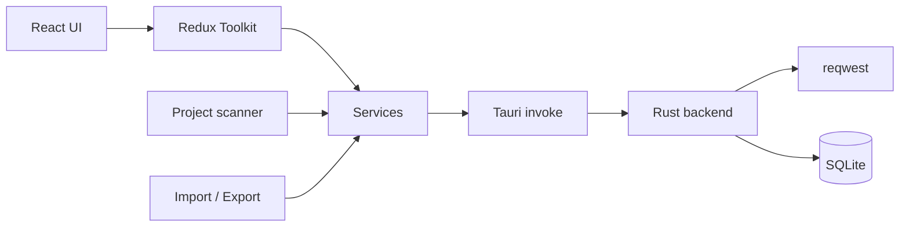

# Fishman

**A modern, native desktop API client for developers who care about speed, privacy, and flow.**

Fishman is a lightweight REST client built with **Tauri v2** and **React**. It feels like a focused IDE for APIs — resizable panels, multi-tab requests, environments, collections, and a project scanner that turns your backend code into ready-to-hit endpoints.

No Electron bloat. No cloud lock-in. Your requests, history, and secrets stay on your machine.

```
npm install && npm run tauri dev
```

---

## Why Fishman?

| | Fishman | Typical API clients |
|---|---|---|
| **Runtime** | Native Tauri + Rust HTTP | Heavy Electron / browser-only |
| **Data** | Local SQLite — yours alone | Often cloud-synced by default |
| **Code → collections** | Scan Express, NestJS, Fastify, and more | Manual entry or OpenAPI only |
| **UI** | VS Code-style, keyboard-first | Cluttered or web-app laggy |
| **Import / export** | Postman + native Fishman format | Vendor-specific silos |

**Built for the way you actually work:**

- **Native performance** — HTTP runs through Rust (`reqwest`), not a Chromium network stack. Fast sends, low memory.
- **Privacy by design** — collections, environments, history, and settings live in local SQLite. Nothing leaves your machine unless you export it.
- **Code-aware** — point Fishman at a Node project and it discovers routes, builds a collection, and gets you testing in seconds.
- **Developer UX** — Monaco editor, variable-aware inputs, dark/light/system themes, and shortcuts that stay out of your way.
- **Migration-friendly** — import Postman collections and export Fishman or Postman when you need to share.

---

## Features

### Request builder

- Full REST methods: `GET`, `POST`, `PUT`, `PATCH`, `DELETE`, `OPTIONS`, `HEAD`
- Query params, headers, and auth in dedicated tabs
- Body types: JSON, form-data (text + files), `x-www-form-urlencoded`, raw, XML, HTML, GraphQL, binary
- Auth: Bearer, Basic, API Key (header or query), JWT, OAuth2 token, custom header
- Multi-tab workspace with pin, unsaved indicators, and close shortcuts

### Response viewer

- **Pretty** view with Monaco + interactive JSON tree
- **Raw**, **Headers**, and timing details
- JSON tools: beautify, minify, copy, download
- HTML response preview when the body is markup
- Status badges, size, and duration at a glance

### Collections & history

- Nested folders with rename, duplicate, and delete
- Organize requests the way your API is structured
- Auto-saved history grouped by date — replay anything you sent

### Environments & variables

- **Global** and **collection-scoped** environments
- `{{variable}}` substitution in URLs, headers, params, body, and auth
- Variable-aware inputs with live scope hints
- Switch environments without rewriting requests

### Project scanner

Point Fishman at a Node.js project and auto-generate a collection from real routes.

**Supported frameworks today:**

| Framework | Detection |
|-----------|-----------|
| Express | `express` dependency |
| Fastify | `fastify` dependency |
| Koa | `koa` dependency |
| Hono | `hono` dependency |
| Elysia | `elysia` dependency |
| NestJS | Nest decorators / structure |
| Next.js | App / route conventions |
| Bun / Nitro | Bun ecosystem markers |

AST-based scanning (Babel + analysis) picks up mounts, routers, and handler bindings — not just string greps.

### Import & export

- **Import:** Postman collections, Fishman format
- **Export:** Fishman and Postman
- Conflict strategies: replace, merge, duplicate, or skip
- Optional variables, secrets, and metadata on export

### App experience

- VS Code-style layout: sidebar + request / response panels (resizable, layout remembered)
- Custom title bar, status bar, and brand loading states
- Themes: dark, light, or follow system
- Settings: request timeout, ignore SSL, sidebar collapse
- Keyboard-first workflow (see shortcuts below)

---

## Keyboard shortcuts

| Shortcut | Action |
|----------|--------|
| `Ctrl` / `⌘` + `Enter` | Send request |
| `Ctrl` / `⌘` + `S` | Save active request |
| `Ctrl` / `⌘` + `N` | New request tab |
| `Ctrl` / `⌘` + `W` | Close active tab |

---

## Tech stack

| Layer | Technology |
|-------|------------|
| Desktop shell | Tauri v2 |
| Frontend | React 19, TypeScript, Vite |
| Styling | Tailwind CSS v4, shadcn/ui, Radix |
| State | Redux Toolkit |
| HTTP | `reqwest` (Rust) |
| Database | SQLite via `tauri-plugin-sql` |
| Editor | Monaco Editor |
| JSON view | `@uiw/react-json-view` |
| Scanner | Babel parser / traverse, ts-morph |

Native plugins: filesystem, dialogs, opener, SQL.

---

## Prerequisites

- [Node.js](https://nodejs.org/) **20+**
- [Rust](https://rustup.rs/) (stable)
- Platform deps for Tauri — see [Tauri prerequisites](https://tauri.app/start/prerequisites/)

**Ubuntu / Debian:**

```bash
sudo apt install libwebkit2gtk-4.1-dev build-essential curl wget file \
  libssl-dev libayatana-appindicator3-dev librsvg2-dev
```

---

## Getting started

```bash
# Install dependencies
npm install

# Run in development (Vite + Tauri)
npm run tauri dev

# Production build
npm run tauri build

# Unit tests
npm test
```

### Quick smoke test

After launch, try:

- `GET https://httpbin.org/get`
- `POST https://httpbin.org/post` with body `{"hello":"world"}`

---

## Project structure

```
fishman/
├── src/                      # React frontend
│   ├── app/                  # App shell & providers
│   ├── components/           # UI by feature (request, response, collections, …)
│   ├── pages/                # Top-level views
│   ├── store/                # Redux slices, thunks, selectors
│   ├── services/             # API, DB, import/export, environments
│   ├── scanner/              # Project → collection scanner
│   ├── import-export/        # Format plugins (Postman, Fishman)
│   ├── hooks/                # Shared React hooks
│   ├── utils/                # Helpers (variables, formatting, …)
│   ├── types/                # TypeScript models
│   └── tauri/                # Typed invoke wrappers
├── src-tauri/                # Rust backend
│   ├── src/                  # HTTP client, commands, plugins
│   └── migrations/           # SQLite schema
├── public/                   # Static assets
└── package.json
```

---

## Architecture at a glance



- **UI** owns layout, tabs, and editors.
- **Redux** holds drafts, responses, collections, environments, and settings.
- **Rust** executes HTTP and persists data — the frontend never talks to the network directly for requests.
- **Scanner** and **import/export** feed the same collection model, so scanned routes and Postman imports behave like hand-built requests.

---

## Configuration & data

| Setting | Default | Notes |
|---------|---------|--------|
| Theme | System | Light / dark / system |
| Timeout | 30s | Per-request wait limit |
| Ignore SSL | Off | For local / self-signed certs |
| Environments | — | Global + per-collection active env |

All of this is stored locally via SQLite migrations under `src-tauri/migrations/`.

---

## Roadmap-friendly design

The import/export and scanner layers are **plugin-based**. Formats and frameworks can be added without rewriting the core app. Planned format hooks include Bruno, OpenAPI/Swagger, Insomnia, HAR, and cURL; language detection already anticipates Python, Go, Rust, Java, PHP, C#, and Ruby for future scanners.

---

## Contributing

Fishman is early (`v0.1.0`) and moving fast. Ideas, bugs, and PRs are welcome:

1. Fork and branch from `main`
2. `npm install` → `npm run tauri dev`
3. Keep changes focused; match existing patterns in `src/` and `src-tauri/`
4. Run `npm test` before opening a PR

---

## License

Private / unlicensed for now — treat as proprietary unless a license file is added.

---

<p align="center">
  <strong>Fishman</strong> — modern API client for developers.<br/>
  Open a request. Hit send. Stay in flow.
</p>
